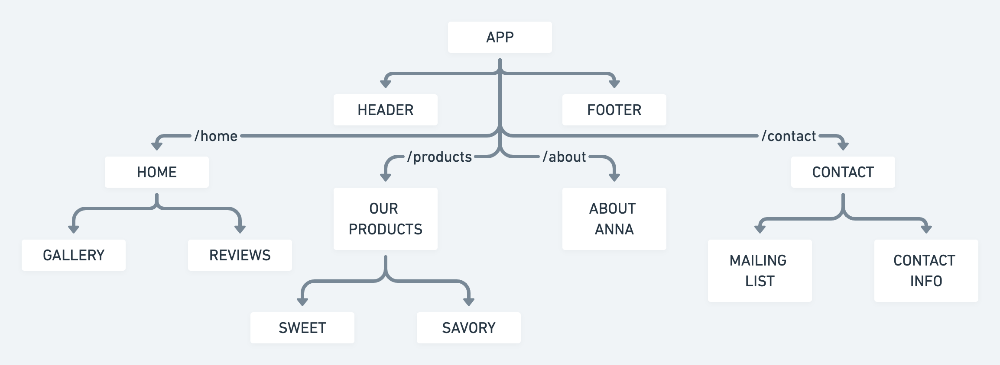

# [Anna's Kitchen]()

## App Description

_Anna's Kitchen_ is a **business website** for a baker from Pasadena, CA.
The site will display pictures of Anna's previous work and reviews from her clients as the "Home" page. Anna's Kitchen's staples will be featured in the "Our Products" page, both sweet and savory options, including brief descriptions of them.
On the "About Anna" section of the site, Anna's future clients will get to learn a bit more about her, and her plans for the Kitchen. Finally, in the "Contact" section, visitors will find all of Anna's Kitchen's contact information, and a form to join her mailing list.

## Wireframes

- #### Mobile View

- #### Desktop View

## Components Hierarchy

## API

- **Name**: Anna's Kitchen.
- **URL**: <https://api.airtable.com/appxfcqMlzJLg81EN>
- **Information to be accessed**:
  - Client List Table
  - Sweet Table
  - Savory Table

## API Snippet

## Minimum Viable Product (MVP)

- A working, interactive React app.
- Utilize React Router for the main four rendered components: "Home" (/home), "Our Products" (/products), "About Anna" (/about) and "Contact" (/contact); and their respectives sub-components.
- A Header and Footer components.
- GET/render the products from the Sweet and Savory tables from an Airtable base using Axios.
- POST/create a new entry on the Client List table from an Airtable base usin Axios.

## Post-MVP

- Turning the gallery at the "Home" page and interactive one, with embedded Instagran pictures.
- An "Online Orders" section connected to an Airtable table.
- Hovering over the footer icons will display the linked information.
- A "Contact" form that includes a section to upload pictures for reference.

## Goals

| **Date** | **Goals**                                                                                                                         |
| :------: | --------------------------------------------------------------------------------------------------------------------------------- |
|   12/3   | Create HTML _boilerplate_, _component files_ and _Axios_ function.                                                                |
|   12/4   | Meet with client to _create tables_ and to define _CSS properties' values_ (colors, fonts, positioning). Create CSS _stylesheet_. |
|   12/5   | Finalize _About_, _Footer_ and _Header_ components, including the _stylesheet_.                                                   |
|   12/6   | Finalize _Home_, _Products_ and _Contact_ components, including the _stylesheet_.                                                 |
|   12/7   | _Test_ and _debug_ MVP features.                                                                                                  |
|   12/8   | Implement _Post-MVP_ features.                                                                                                    |

## Timeframes

| **Task**                                                   | **Estimated time** | **Invested time** |
| ---------------------------------------------------------- | -----------------: | ----------------: |
| Choose colorscheme and fonts                               |            3.0 hrs |           0.0 hrs |
| Create _component files_                                   |            1.5 hrs |           0.0 hrs |
| Create and configure _tables_                              |            3.0 hrs |           0.0 hrs |
| Set _axios_                                                |            4.0 hrs |           0.0 hrs |
| Create CSS _stylesheet_ for mobile                         |            3.0 hrs |           0.0 hrs |
| Configure _Header_, _Footer_ and _About_ components        |            4.0 hrs |           0.0 hrs |
| Configure _Home_, _Products_ and _Contacts_ components     |            4.0 hrs |           0.0 hrs |
| Create CSS _media query_ for desktop                       |            3.0 hrs |           0.0 hrs |
| _Clean up_ code y comments                                 |            3.0 hrs |           0.0 hrs |
| Finalize CSS _stylesheet_                                  |            3.0 hrs |           0.0 hrs |
| _Test_ and _debug_                                         |            3.0 hrs |           0.0 hrs |
| Create _functions_ for _post-MVP_ features                 |            3.0 hrs |               N/A |
| Create CSS _stylesheet_ parameters for _post-MVP_ features |            3.0 hrs |               N/A |
| Project Total Hours                                        |           40.5 hrs |           0.0 hrs |

## SWOT Analysis

